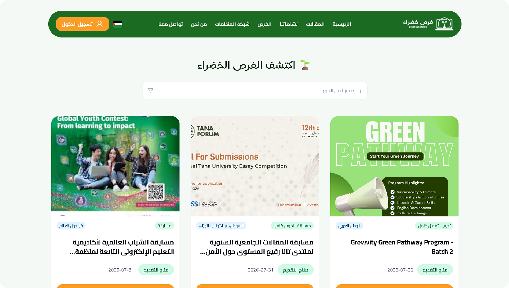
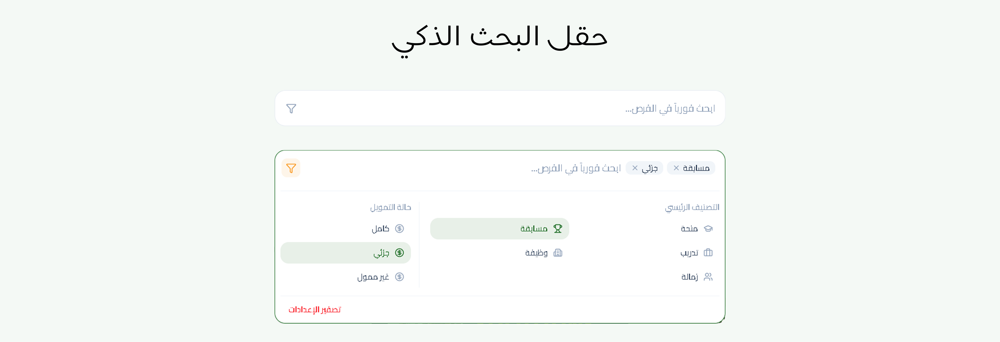
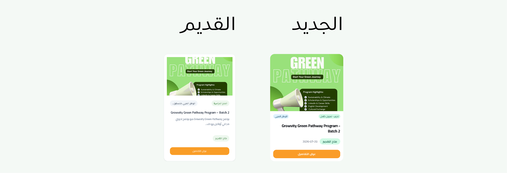
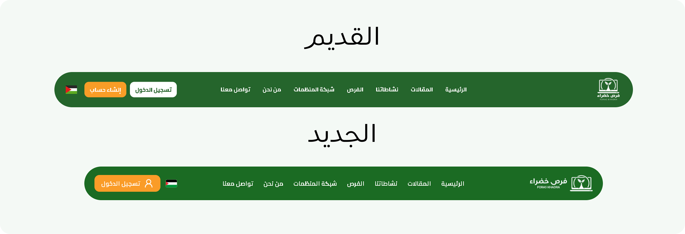
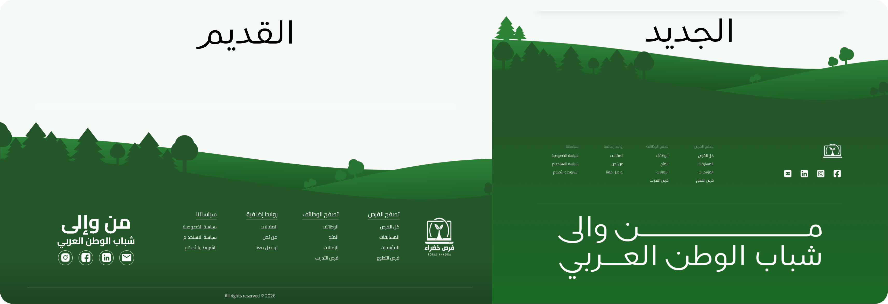
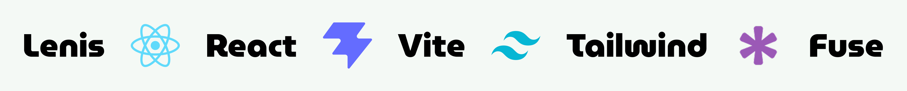

# فرص خضراء - Foras Khadra

 

 

## نظرة عامة - Overview

فرص خضراء هي منصة تفاعلية صُممت لجمع ونشر المنح الدراسية، التدريبات، والمسابقات البيئية الموجهة للشباب العربي. تم تطوير هذا العمل كمتطلب أساسي للتقديم على فرصة التطوع، ويركز حالياً على بناء وتصميم "صفحة الفرص" لتقديم تجربة تصفح وبحث سلسة ومباشرة للمستخدمين.

**🔗 [اضغط هنا للمعاينة الحية](https://foras-khdra-task.vercel.app/)**

 

 

## الواجهة والتصميم - UI/UX

- **تصميم مينيماليستي (Minimalism):** واجهة عصرية وبسيطة تركز على المساحات المريحة للعين وتقليل التشتت البصري لتركيز الانتباه على المحتوى والفرص المتاحة.
- **تناسق تام مع الهوية البصرية:** استخدام دقيق للألوان يعكس الطابع البيئي للمنصة (تدرجات الأخضر الهادئ والبرتقالي الحيوي) مع خطوط عربية مخصصة تمنح شعوراً بالاحترافية.
- **التصميم المتجاوب (Responsive Design):** واجهة مرنة ومتوافقة بالكامل مع جميع الشاشات (الهواتف، الأجهزة اللوحية، والشاشات المكتبية) لضمان تجربة تصفح ثابتة.
- **تأثيرات حركية ناعمة:** تفاعلات خفيفة وسلسة عند تمرير الفأرة (Hover Effects) على البطاقات والأزرار تعزز من حيوية الواجهة دون التأثير على الأداء.
- **البطاقات المنظمة (Clean Cards):** عرض واضح للتفاصيل الأساسية (الجهة المانحة، نوع التمويل، التصنيف) مع استخدام ذكي للأيقونات لتسهيل القراءة السريعة.

 

## حقل البحث الذكي - Smart Search Bar

- **البحث المرن (Fuzzy Search):** يعتمد على Fuse.js للبحث في العناوين والأوصاف، مع تصحيح الأخطاء الإملائية تلقائياً.
- **الحذف الذكي (Backspace):** يمكنك إزالة فلاتر البحث النشطة خطوة بخطوة بمجرد الضغط على زر Backspace عندما يكون حقل الإدخال فارغاً.
- **الإغلاق التلقائي عند التمرير:** تُغلق قائمة الفلاتر المنسدلة تلقائياً بمجرد التمرير لأسفل (بمقدار 40px) لتوفير مساحة رؤية أكبر.
- **الإغلاق عند النقر بالخارج:** تختفي لوحة الفلاتر فوراً بمجرد النقر في أي مكان خارج صندوق البحث (باستخدام useRef).
- **شارات الفلاتر الديناميكية:** تظهر الفلاتر النشطة كشارات صغيرة داخل شريط البحث يمكن حذفها بنقرة واحدة، مع تصميم نظيف يخفي أشرطة التمرير.
- **تصفير الإعدادات بضغطة واحدة:** يظهر زر "إعادة التعيين" ذكياً وفقط عند وجود فلاتر نشطة، للعودة للوضع الافتراضي فوراً.

 

## البطاقات - Cards

- **تصميم متجاوب وتأثيرات حركية تفاعلية:** بطاقات بتصميم عصري وحواف دائرية تتكيف تماماً مع مختلف أحجام الشاشات، مع تأثير حركي سلس (Hover Effect) يرفع البطاقة ويبرز ظلها عند مرور مؤشر الفأرة لزيادة التفاعل.
- **فحص تلقائي وديناميكي لحالة التقديم:** احتساب حالة الفرصة (متاح / انتهى التقديم) تلقائياً عبر مقارنة تاريخ اليوم بالموعد النهائي (Deadline)، مع تلوين الشارات ديناميكياً (أخضر/أحمر) لتنبيه الزائر فوراً.
- **دمج ذكي للبيانات والشارات:** معالجة مرنة لعرض الدول المستهدفة (أو إظهار "كل دول العالم" تلقائياً)، بجانب دمج نوع الفرصة مع حالة التمويل (مثل: منحة - تمويل كامل) في شارة موحدة ومختصرة لتقليل التشتت البصري.
- **تحسين الأداء واستقرار الواجهة:** استخدام تقنية التحميل الكسول للصور (`loading="lazy"`) لتسريع تصفح الموقع، مع معالجة النصوص الطويلة وعناوين الفرص عبر خواص القطع (`line-clamp` و `truncate`) للحفاظ على تناسق أبعاد الطول والعرض لجميع البطاقات.

 

## تحسينات إضافية - Additional Features

### الهيدر - Header

- **تعديل الشعار:** تحويل الشعار من الشكل الطولي إلى العرضي ليكون الاسم أكثر وضوحاً وقابلية للقراءة.
- **تبسيط واجهة المستخدم:** إزالة زر "إنشاء حساب" لتقليل تشتت الزائر وتفادي تعقيد التصميم، والاعتماد على تدفق موحد يبدأ من تسجيل الدخول.
- **تحسين تموضع العناصر:** نقل أيقونة تغيير اللغة (العلم) بجانب زر تسجيل الدخول في أقصى اليسار؛ وهو المكان المتعارف عليه تجريبياً مما يسهل على المستخدم الوصول إليه تلقائياً ودون تفكير.
- **تقليص العرض:** تصغير عرض الهيدر قليلاً لجعله أكثر رشاقة، وبساطة، وأقل تشتيتاً للانتباه أثناء التصفح.

 

### الفوتر - Footer

- **تأثير التمرير التفاعلي (Parallax Effect):** إضافة خلفية متعددة الطبقات تتحرك ديناميكياً وبسرعات مختلفة أثناء التمرير (Scroll) مدعومة بـ `requestAnimationFrame` لمنح واجهة المستخدم عمقاً وجاذبية بصرية مميزة.
- **إعادة تنظيم شبكة الروابط:** إعادة ترتيب وتوزيع روابط التنقل والأقسام في شبكة متجاوبة (Grid Layout) لتسهيل الوصول إلى الفرص، الوظائف، والسياسات بشكل منظم ومريح للعين.
- **إبراز الهوية البصرية:** دمج الشعار المبسط (أيقونة فقط) مع استعراض عبارة "من وإلى الشباب العربي" كعنصر تيبوغرافي (SVG) عريض وفخم في الأسفل لترسيخ الهوية والرسالة الأساسية للموقع.
- **التوافق الذكي مع الشاشات الصغيرة:** ضبط قيم ومحددات التأثير الحركي تلقائياً على الهواتف لتقليل المسافة والحركة، مما يضمن أداءً سلسًا ورشيقًا دون التأثير على سرعة التصفح.

 

## التقنيات - Technologies

### 1. React 19 - إطار واجهة المستخدم

- **المفهوم**: يتيح تقسيم الصفحة إلى أجزاء صغيرة ومستقلة تُدعى **مكونات** (Components) مثل شريط التنقل أو بطاقة العرض، مما يسهل إعادة استخدام الكود وصيانته.
- **[قراءة المزيد عن React 19](https://react.dev/)**

### 2. Tailwind CSS v4 - إطار التصميم

- **المفهوم**: أداة لتصميم الواجهات مباشرة داخل كود البرمجة دون الحاجة لملفات CSS منفصلة ومعقدة، وذلك عبر كلاسات جاهزة ومختصرة.
- **[قراءة المزيد عن Tailwind CSS v4](https://tailwindcss.com/)**

### 3. Vite 8 - أداة البناء والتطوير

- **المفهوم**: محرك فائق السرعة يقوم بتشغيل المشروع أثناء البرمجة، ويمتاز بخاصية التحديث الفوري (HMR) التي تعرض التعديلات على الشاشة فور حفظ الملف وبلمح البصر.
- **[قراءة المزيد عن Vite 8](https://vite.dev/)**

### 4. Fuse.js 7 - محرك البحث الذكي

- **المفهوم**: خوارزمية بحث ذكية قادرة على فهم مقصود المستخدم حتى لو كتب الكلمة بشكل خاطئ إملائياً (**Fuzzy Search**)، حيث تبحث في العناوين والتفاصيل وتظهر النتائج الأكثر تقارباً بنسبة تطابق مرنة.
- **[قراءة المزيد عن Fuse.js 7](https://www.fusejs.io/)**

### 5. Lenis 1.3 - التمرير السلس

- **المفهوم**: أداة تلغي حركة التمرير الافتراضية الجافة للمتصفح وتستبدلها بتأثير تمرير ناعم وانسيابي (Smooth Scroll)، وتُستخدم هنا لإعادة المستخدم بلطف إلى أعلى الصفحة عند الانتقال بين الصفحات.
- **[قراءة المزيد عن Lenis 1.3](https://lenis.darkroom.engineering/)**

### 6. Lucide React - مكتبة الأيقونات

- **المفهوم**: مجموعة ضخمة من الأيقونات الجاهزة والخفيفة جداً المصممة بصيغة SVG، تضمن عدم إبطاء تحميل الصفحة وتمنح الواجهة شكلاً متناسقاً وعصرياً.
- **[قراءة المزيد عن Lucide React](https://lucide.dev/)**

 

---

 

